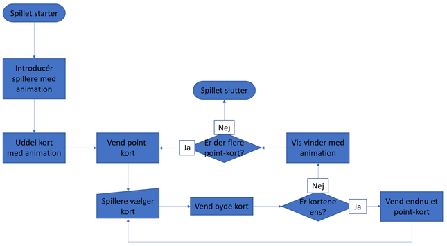

# KortspilDemo

<h1>Kort beskrivelse af projektet</h1>
Vi skal designe et kortspil lignende til hit spillet “Game Of Pure Strategy” eller bare “GOPS”, og vi skal have forklaret vores valg ift. design, mekanismer, hvilke krav, begreber og til sidst programmering.
<h1>1. Kravlister</h1>
1.	Skal kunne understøtte en-to spillere.
2.	Skal kunne håndtere flere kortdæk. 
3.	Skal kunne vise kort på hånden.
4.	Skal kunne lade spilleren vælge kort.
5.	Skal kunne lade spilleren vendte på modstanderen.
6.	Skal kunne sammenligne kort.
7.	Skal kunne gemme point.
8.	Skal have en tidsgrænse på turen.
9.	Skal have en computer-styre-funktion.
10.	Skal kunne afslutte spillet korrekt.
<h1>2. Objektorienteret analyse</h1>
<h2>2.1 Skrive vigtige ting op</h2>
●	Spil - single-/multiplayer
●	Kort- værdi, position
●	Hånd - størrelse,
●	Spiller - navn, point (skjult), type (menneske/computer),
●	Computer - sværhedsgrad,
●	Pointdæk - størrelse, blandes, 
●	Timer - tælle,
●	Lager - vinderhistorik mellem spillere,
 
<h2>2.2 Brugsscenarier - Hvem Hvad Hvor</h2>
En spiltur
Primær aktør    |  Spilleren, modstanderen
Interessenter   |  Systemet
Startsituation  |	 Sidste tur er slut
Slutsituation	  |  Næste tur starter (eller spillet slutter)
Hovedscenarie	  |  1. Der vendes et pointkort
                   2. Begge spillere vælger et kort at byde med.
                   3. Spilleren med det højeste kort vinder pointkortet/ene.
                   4. Runden er slut og en ny startes.
Afvigelser	    |  1. I tilfældet af, at man spiller multiplayer, så ventes der indtil begge spillere har valgt, men hvis tiden går ud, vælges et tilfældig kort.
                   2. Er kortene ens, så uddeles der ingen point.
                   5. Hvis ikke der er flere pointkort i pointkort-bunken, så slutter spillet

Hvis en spiller på noget som helst tidspunkt afslutter deres spil, så overtages spilleren af en bot, og spillet fortsætter.
Åbne spørgsmål	

<h2>2.3 Aktivitetsdiagrammer</h2>
Taget fra Kom/IT opgaven
 
 
<h2>2.4 Skærmbilleder</h2>

Spillet i landscape mode.

  
Hovedmenuen
Spillet i portrait mode
  
Singleplayer, med valg af sværhedsgrad	 multiplayer med forskellige typer
  
Settings(meget simple)	how to play med reglerne i tekst og video format

3. klassediagram
 

